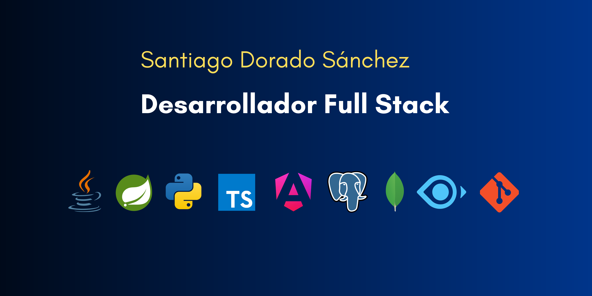

  

# About Me 

**Full-Stack Developer** with a solid foundation and dedication to **best practices**. Committed to applying **agile methodologies** and quality standards to integrate seamlessly into development teams and ensure stability in deliverables. Ready to take on responsibilities, **solve technical challenges with initiative**, and generate measurable impact from day one, always with a **results-oriented approach** that guarantees each project delivers tangible and sustainable outcomes.

My experience covers both **frontend and backend**, with expertise in:
* Designing **scalable architectures** and implementing **APIs**.
* Managing **databases** and developing intuitive, **user-centered interfaces**.
* Maintaining a focus on **efficiency, security, and code maintainability**, complemented by continuous learning.

In addition, I am passionate about leveraging **Artificial Intelligence** to enhance applications, optimize workflows, and deliver smarter solutions. I have experience exploring **AI-driven tools and frameworks** to integrate predictive analytics, automation, and intelligent features that generate **measurable business value** and improve user experience.

I have worked on projects where **AI becomes a driver of innovation**, applying:
* **Machine learning models** to anticipate behaviors and personalize experiences.
* Strategies to **reduce operational times** and transform traditional processes into **advanced digital solutions**.
* A **strategic vision** that aligns technology with business objectives.

Furthermore, I am characterized by **effective collaboration** that facilitates my integration into **multidisciplinary teams**, fostering communication and teamwork, which strengthens the quality and stability of the results achieved.

## Tech Stack

#### Frontend Engineering

 &nbsp; &nbsp; &nbsp; &nbsp; &nbsp;  

#### Backend Architecture & Frameworks

 &nbsp; &nbsp; &nbsp;  

#### Data Management & Storage

 &nbsp; &nbsp; &nbsp;  

#### DevOps, Testing & Quality Assurance

 &nbsp; &nbsp; &nbsp; &nbsp;  

#### Tools & Productivity Methodologies

 &nbsp; &nbsp; &nbsp;  

## Contact & Networking

I am always open to discussing new projects, innovative ideas, or professional opportunities. **Let's build something great together!**

**Email:** [dorado.santiago@outlook.com](mailto:dorado.santiago@outlook.com)

**LinkedIn:** [linkedin.com/in/santiago-dorado-9787543a1](https://www.linkedin.com/in/santiago-dorado-9787543a1)

## License

This project is open-sourced software licensed under the [MIT license](LICENSE). Based on official [Open Source Initiative](https://opensource.org/licenses/MIT) standards, this allows for personal and commercial use with attribution.
